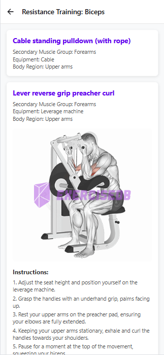
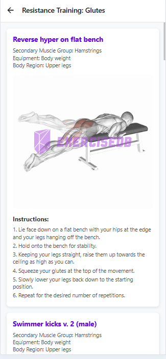
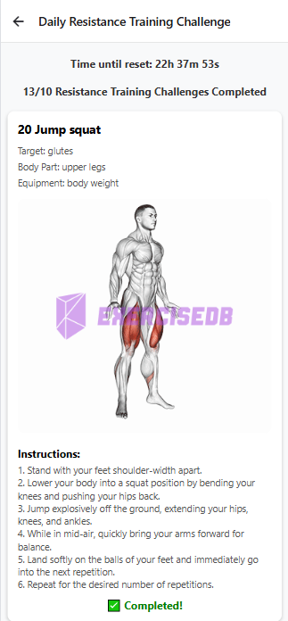
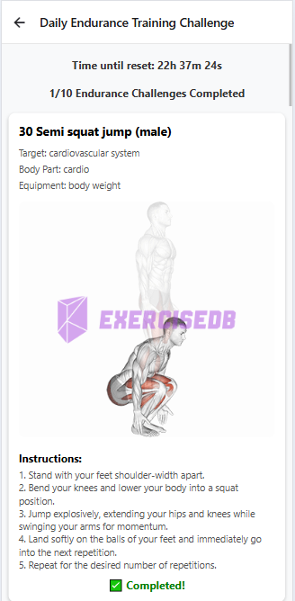
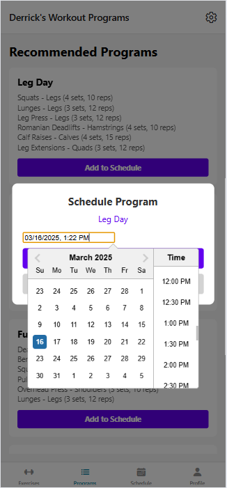
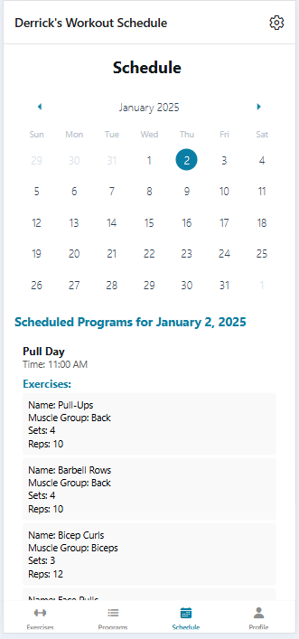
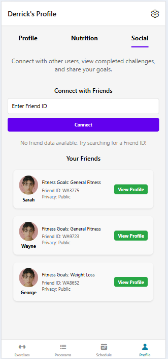
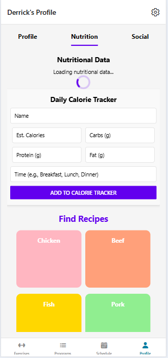
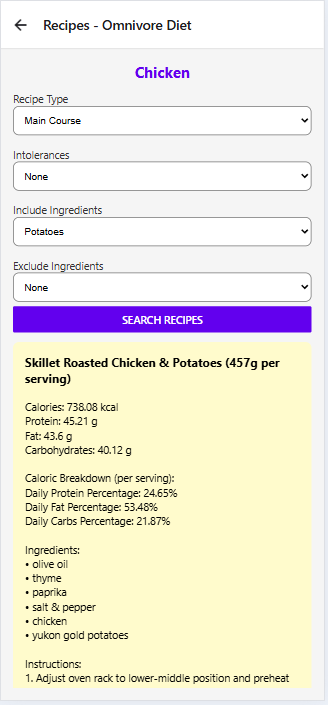

🏋️‍♂️ Work App

📌 Overview
This is a React Native Expo fitness app that helps users find exercises for specific muscle groups, track nutrition, and schedule workout programs. Built using TypeScript and Firebase, the app provides a seamless experience for managing fitness goals.

✨ Features
🔍 Search Exercises – Find exercises based on targeted muscle groups.
🥗 Nutritional Information & Recipes – Search for recipes and nutrition facts based on a protein (e.g., chicken, beef, tuna), including vegan & vegetarian options.
👤 User Profiles – Firebase-powered authentication for user sign-in and profile management.
📅 Workout Scheduling – Plan and schedule workout programs on specific days.

🚀 Getting Started
1️⃣ Install dependencies
- npm install
2️⃣ Start the app
- npm start
You'll see options to run the app on:

✅ Development Build
📱 Android Emulator
🍏 iOS Simulator
🌐 Expo Go
🔧 Tech Stack
React Native Expo – For cross-platform mobile development
TypeScript – Strongly typed JavaScript for better reliability
Firebase – Authentication and backend services

🖼️ Screenshots

📚 Learn More
Check out these resources to dive deeper into Expo and React Native:

Expo Documentation
React Native Docs
